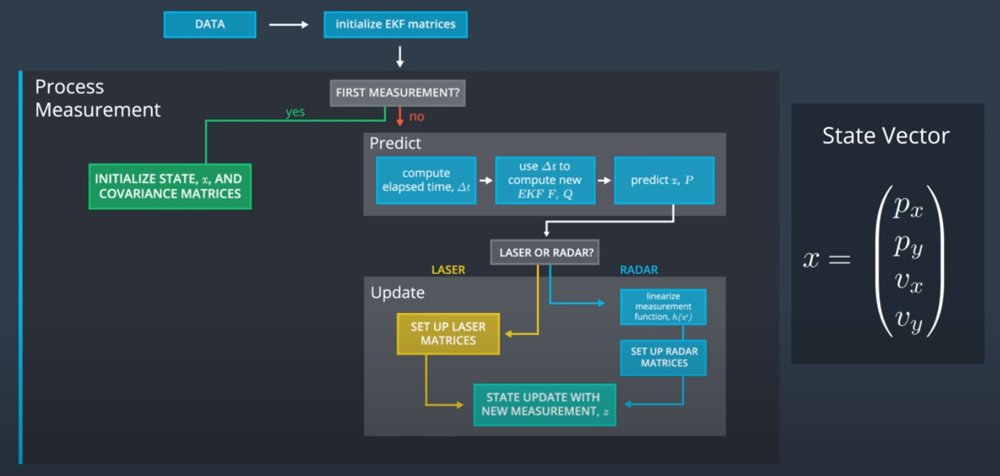

# Extended Kalman Filter
---
## Rubric Points
---
Here I will consider [the rubic points](https://review.udacity.com/#!/rubrics/748/view) individually and describe how I addressed each point in my implementation.

1. RMSE of output coordinates is below threshold  

    My px, py, vx, and vy RMSE are less than or equal to the values ​​[.11, .11, 0.52, 0.52]  

    The EKF accuracy was:  
    Dataset 1 : RMSE <= [0.0973, 0.0855, 0.4513, 0.4399]  
    Dataset 2 : RMSE <= [0.0726, 0.0967, 0.4579, 0.4966]  

1. Sensor Fusion algorithm follows the general processing flow.  

      

    1. Represented by two-dimensional position and two-dimensional speed  
    
        Instance is assigned when the ProcessMeasurement function of FusionEKF class is not initialized by conditional branching.
        It is described in line 78 of `src/FusionEKF.cpp`.      

    1. Get new readings from a specific sensor  
        It is obtained from the main function as an argument to the ProcessMeasurement function, which is a member function of the FusionEKF class.

    1. For the first time, simply initialize the state and covariance matrix  
        The state is initialized in lines 77-101 of `src/FusionEKF.cpp`.
        However, the covariance matrix is ​​done in the constructor.

    1. From the second time onward, perform "prediction" and "update measurement"  
        "prediction" and "update measurement" are made in lines 111-155 of `src/FusionEKF.cpp`.

    1. Prediction phase  
        1. Calculate the elapsed time Δt until this observation before prediction  
            It is described in line 111 of `src/FusionEKF.cpp`.  
        1. Create matrices F, Q to calculate new state transitions from elapsed time  
            Matrices F and Q are made in lines 112-131 of `src/FusionEKF.cpp`.
        1. Calculate the error covariance matrix P and the predicted estimate x  
            P and x are Calculated in lines 28-30 of `src/kalman_filter.cpp`.
    1. Update phase
        1. Separate measurement updates according to sensor type  
            It is described in line 139 of `src/FusionEKF.cpp`. 

        1. For radar observations, a new Jacobian Hj is calculated and a nonlinear measurement function is used to project the predicted state and update the observations.  
            The new Jacobian Hj to be calculated is described in lines 46-69 of `src/tools.cpp`.  
            Update Function is described in lines 45-69 of `src/kalman_filter.cpp`.  

        1. Update the observed values ​​using the laser observation model H matrix and the covariance matrix R matrix.
            Update Function is described in lines 34-41 of `src/kalman_filter.cpp`.  


1. Kalman Filter algorithm handles the first measurements appropriately.  
    The constructor determines the covariance matrix below
    ```cplus
    //measurement covariance matrix - laser
    R_laser_ << 0.0225,      0,
                     0, 0.0225;
    //measurement covariance matrix - radar
    R_radar_ << 0.09,      0,    0,
                   0, 0.0009,    0,
                   0,      0, 0.09;
    ```

    For the state, set the velocities vx and vy to 0 and get the coordinates according to the sensor type.
    It is described in lines 80-97 of `src/FusionEKF.cpp`. 
    ```cplus
    if (measurement_pack.sensor_type_ == MeasurementPackage::RADAR) {
    // TODO: Convert radar from polar to cartesian coordinates 
    //         and initialize state.
    float rho = measurement_pack.raw_measurements_[0];
    float phi = measurement_pack.raw_measurements_[1];

    x << std::max(rho*cos(phi), 0.0001),
        std::max(rho*sin(phi), 0.0001),
        0.f,
        0.f;
    }
    else if (measurement_pack.sensor_type_ == MeasurementPackage::LASER) {
    // TODO: Initialize state.
    x << measurement_pack.raw_measurements_(0),
        measurement_pack.raw_measurements_(1),
        0.f,
        0.f;
    }    
    ```
1. Kalman Filter algorithm first predicts then updates.  
    Described in `Sensor Fusion algorithm follows the general processing flow.`

1. Kalman Filter can handle radar and lidar measurements.  
    I think that it can be handled because RMSE is below the threshold.
    
